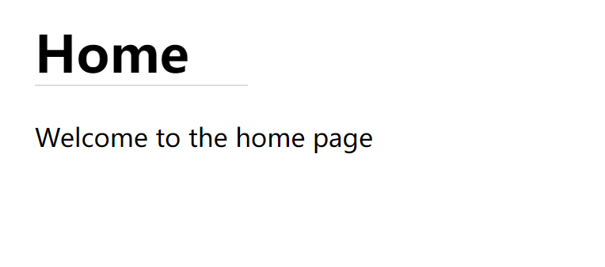
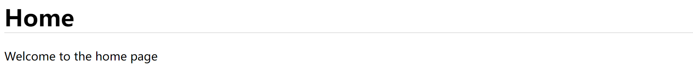
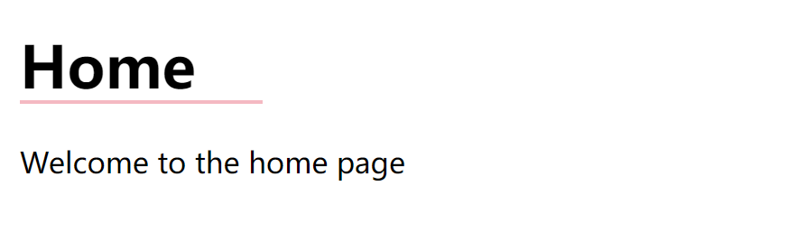
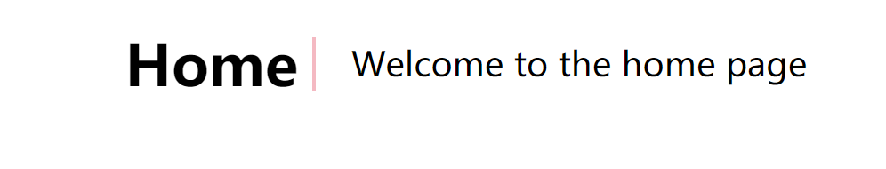

### 实现效果

> 如何在`Home`下添加如图所示**短横线**
>


<!-- more -->
### 实践

#### 使用`border`

看到的第一眼可能大部分人都会用`border-bottom`，但是写上之后会发现，效果有点不太对：

```css
.home h1 {
    border-bottom: 1px solid #ddd;
}
```




确实是加了一条横线，但是没法调整长度。换一种思路试试

#### 使用伪元素

不要把短横线看成`border`，而是用**伪元素**来实现。这样不仅是改变长度，大小、颜色、宽度，甚至是可以改变方向

```css
selector::pseudo-element {
  property: value;
}
```

> 伪元素就是用于设置元素指定部分的样式，可用于设置元素的首字母、首行的样式，在元素的内容之前或之后插入内容等
>
> *了解更多：[**伪元素 - CSS：层叠样式表 | MDN**](**[伪元素 - CSS：层叠样式表 | MDN (mozilla.org)](https://developer.mozilla.org/zh-CN/docs/Web/CSS/Pseudo-elements)**)*

实现：

```css
.home h1::after {
    /* 伪元素必须有content属性*/
    content: '';
    /* 绝对定位，别忘了给父级添加relative */
    position: absolute;
    left: 0;
    bottom: 0;
    /* 宽度为10%，高度为2px */
    height: 2px;
    width: 10%;
    /* 横线颜色为粉色 */
    background-color: pink;
    box-sizing: border-box;
}
```

来看看效果：



非常完美。接下来看试试看将横线变为纵向的分割线：

```css
.home h1::after {  /* 在h1后方添加元素*/
    /* 伪元素必须有content属性*/
    content: '';
    /* 绝对定位，别忘了给父级添加relative */
    position: absolute;
    right: -10px;
    top: 50%;
    transform: translateY(-50%);
    /* 宽度为2px，高度为30px */
    height: 30px;
    width: 2px;
    /* 横线颜色为灰色 */
    background-color: lightpink;
    box-sizing: border-box;
}
```

效果：



### 总结

将上述代码总结一下，在以后也可以用在其他场景。

```css
selector::after {
    content: '';
    position: absolute;
    left: 0;
    top: 0;
    bottom: 0px;
    right: 0;
    height: 0px;
    width: 0px;
    background-color: ;
}
```

而且我们不难发现，分割线的**横纵**其实区别就在于**该分割线的宽高值**。将`width`设为1或2像素，`height`设为想要的长度，那么这个分割线就是纵向的。反之分割线为横向的。
