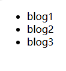

### 概念

本质上，**webpack** 是一个用于现代 JavaScript 应用程序的 *静态模块打包工具*。当 webpack 处理应用程序时，它会在内部从一个或多个入口点构建一个依赖图，然后将你项目中所需的每一个模块组合成一个或多个 *bundles*，它们均为静态资源，用于展示你的内容。

<!-- more -->

### 快速开始


`webpack`是基于`node.js`运行的，请确保node.js最低版本为10.13


#### 构建项目

首先创建一个文件夹，取任意名字。再进行初始化：
<div style="margin: 0 0 20px 0; padding: 10px 20px 20px 20px; border-radius: 6px; box-shadow: 0 0.5em 0.75em -0.125em rgba(10, 10, 10, 0.1), 0 0px 0 1px rgba(10, 10, 10, 0.02);">
	
	<!-- tab id:1 title:npm active -->
	`npm init -y`
	<!-- endtab -->
	<!-- tab id:2 title:yarn -->
	`yarn init -y`
	<!-- endtab -->
	<!-- tab id:3 title:pnpm -->
	`pnpm init -y`
	<!-- endtab -->
	
</div>
<br>

> 后续我们使用npm进行示例


创建完成之后添加`webpack`依赖。

```powershell
npm add webpack webpack-cli --dev
```

使用`--dev`表示将webpack相关的依赖添加的开发者环境中。毕竟我们只有开发的时候会使用到webpack

------


#### 进行第一次打包

使用ide打开项目，并创建`src`目录，在目录下创建`index.js`文件。随便在里面写点东西

```javascript
console.log('Hello World!')
```

再去项目更目录创建一个`index.html`文件。将index.js引入此文件中

```html
<script src="./src/index.js"></script>
```

运行网页，在控制台中发现成功打印出了`Hello World!`

现在进行第一次进行webpack打包，使用命令行运行打包指令：

```
npx webpack
```

这样就完成了第一次打包，并且在项目目录中新加了一个`dist`目录，目录下有个`main.js`文件，其中的语句和我们在`index.js`中编写的一样。因为此时我们没有用到`import`导入任何的依赖。

这时候我们在html文件中的index.js的引用改为main.js，并更新页面。

```html
<script src="./dist/main.js"></script>
```

此时控制台依然可以成功打印出`Hello World!`

------


#### 添加依赖

此时我们试试在有依赖的情况下，打包后的代码是什么样的。
首先在src目录下新建一个`data.js`文件。里面导出一个函数来返回一串博客列表的数据：

```javascript
export function getBlogPosts() {
    return ["blog 1", "blog 2", "blog 3"];
}
```

然后在`index.js`中打印语句进行修改

```javascript
import { getBlogPosts } from "./data";

console.log(getBlogPosts());
```

此时再运行打包指令`npx webpack`后，查看main.js中的文件，发现此时语句并不和index.js中一致了

```javascript
// main.js
(() => {
	'use strict';
	console.log(['blog1', 'blog2', 'blog3']);
})();

```

说明webpack在打包时自动判断了代码的逻辑，并且简化了代码语句。并且此时再浏览器控制台中依然可以打印出博客列表的数据。

------


#### 配置文件

webpack最核心的一个部分就是他的配置文件，我们可以修改webpack 的各种配置比如`入口(entry)`、`输出(output)`、`loader`、`插件(plugin)`、`模式(mode)`、`浏览器兼容(browser compatibility)`以及`环境(environment)`。可以浏览webpack官方中文文档来获取详细信息。

> - [概念 | webpack 中文文档 (docschina.org)](https://webpack.docschina.org/concepts/)

------


##### 修改打包后的文件名

我们先试试将打包后的文件名修改一下：

1. 首先在项目根目录下创建一个webpack配置文件: `webpack.config.js`

2. 在文件中对webpack进行配置：

   ```javascript
   const path = require('path') // 引入path模块
   
   module.exports = {
   	mode: 'development', // 设置开发环境
   	entry: './src/index.js', // 入口文件
   	output: { // 输出
   		filename: 'dist.js', // 打包后的文件名
   		path: path.resolve(__dirname, 'dist'), // 打包后的目录
   	},
   }
   ```

3. 再运行打包指令

   `npx webpack`

此时我们发现在dist目录下新加了一个`dist.js`文件，这正是我们修改完配置后生成的，并且里面新增了很多代码，这是因为我们现在的环境改成了开发模式。我们再将html文件中引入的js文件修改为`dist.js`

```html
<script src="./dist/dist.js"></script>
```

刷新页面，控制台依旧打印出博客列表数组，这时候我们就可以将旧的`main.js`文件删除

------


##### 使用`loader`来导入`CSS`文件

首先我们先将`index.js`中的语句修改一下，改为在页面渲染一个列表，为后续添加样式做铺垫

```javascript
import { getBlogPosts } from './data';

const blogs = getBlogPosts();
const ul = document.createElement('ul');
blogs.forEach(blog => {
    const li = document.createElement('li');
    li.innerText = blog;
    ul.appendChild(li);
});
document.body.appendChild(ul);
```

先打包后刷新页面，看看是否渲染出了博客列表:



然后我们在src目录中新建一个`style.css`文件，随便写点样式



*{
margin: 0;
padding: 0;
}

body {
	display: grid;
	place-items: center;
	height: 100vh;
}

ul {
	list-style: none;
}

li {
	padding: 12px;
}
img {
	max-width: 500px;
}



我们再将css文件导入到`index.js`中。这样才能充分利用到webpack，如果在html文件中导入，那就和普通的导入没有什么区别了

```javascript
import { getBlogPosts } from './data';
// 导入css文件的路径
import './style.css';
```

如果我们现在直接进行webpack打包，会发现控制台报错

```
ERROR in ./src/style.css 1:0
Module parse failed: Unexpected token (1:0)
You may need an appropriate loader to handle this file type, currently no loaders are configured to process this file. See https://webpack.js.org/concepts#loaders
// 您可能没有合适的loader来加载这种文件类型
> * {
|       margin: 0;
|       padding: 0;
 @ ./src/index.js 2:0-21

webpack 5.94.0 compiled with 1 error in 53 ms
```

那是因为我们还没有使用loader来加载css。想要加载css文件我们需要安装两个loader：`style-loader`、`css-loader`

```
npm add --dev style-loader css-loader
// 注意，我们所有关于webpack相关的依赖都使用--dev来添加，因为只有在开发环境中才能用到
```

安装完成中在`webpack.config.js`中添加loader，在这里需要要配置使用什么样的文件拓展名来使用哪一个loader

```javascript
const path = require('path'); // 引入path模块

module.exports = {
	mode: 'development', // 设置开发环境
	entry: './src/index.js', // 入口文件
	output: {
		filename: 'dist.js', // 打包后的文件名
		path: path.resolve(__dirname, 'dist'), // 打包后的目录
	},
    module: { // 模块配置
        rules: [ // 规则
            {
                test: /\.css$/i, // 匹配css文件 使用正则表达式
                use: ['style-loader', 'css-loader'], // 使用的loader
            }
        ]
    }
};

```

然后再运行打包指令，刷新页面。发现网页样式已经改变：


> 在使用SASS或者Less等css预处理文件，也可以通过对应的loader来配置

------


##### 如何加载图片

对于图片等静态图片的文件，webpack就不用安装额外的loader，直接可以在rules里添加规则

```javascript
{
	test: /\.(png|svg|jpg|jpeg|gif)$/, // 匹配图片文件
    type: 'asset/resource', // 使用资源模块类型
}
```

然后在src目录下新建一个静态资源目录`assets`，在里面创建一个`images`目录来存放图片。

在index.js文件中导入我们的图片，并且给他设置个名字

```javascript
import AvatarImage from './assets/images/avatar.png';
```

再引用图片添加到网页的开头

```javascript
const img = document.createElement('img');
img.src = AvatarImage;
document.body.prepend(img);
```

运行打包命令，刷新网页。发现图片已经成功的渲染到网页中。并且打包目录`dist`中图片名称也变成了随机的字符串

------


##### 使用插件自动生成html文件

现在我们的html文件是自己手写的，非常容易出错，我们可以借助一个插件来使webpack打包时自动生成一个html文件。这个插件就是`html-webpack-plugin`

```
npm add --dev html-webpack-plugin
```

在webpack配置文件中引入插件 然后在配置项里添加一个`plugins`配置项来使用插件

```javascript
const HtmlWebpackPlugin = require('html-webpack-plugin'); // 引入html-webpack-plugin插件

plugins: [new HtmlWebpackPlugin()], // 使用插件
```

使用指令打包，这时在打包目录中会生成一个新的html文件。打开发现跟我们之前的页面是一模一样的。

如果我们想给这个网页名称修改，可以在配置项中传递一个对象参数

```javascript
plugins: [
		// 使用插件
		new HtmlWebpackPlugin({
			title: 'List of Blogs', // 设置html的title
		}),
	],
```

打包并刷新页面，发现网页标题变成了我们修改的标题

------


##### 使用`babel`来使js语句更兼容

有时候我们写js的时候会用到新的特性，但是有些浏览器不支持，那么可以使用webpack对应的loader来使我们的代码转义为更有兼容性的代码。

比如我们上面写的`forEach`使用的是箭头函数，我们使用对应的loader之后就会在打包的时候将箭头函数转换成普通函数，来确保适配更多的浏览器。

1. 添加loader依赖

   ```
   npm add --dev babel-loader @babel/core @babel/preset-env 
   ```

   

2. 在rules中匹配js文件

   ```javascript
   {
       test: /\.js$/, // 匹配js文件
       exclude: /node_modules/, // 排除node_modules文件夹
       use: {
           loader: 'babel-loader', // 使用babel-loader
           options: {
               presets: ['@babel/preset-env'], // 使用babel预设
           },
       },
   },
   ```

3. 使用打包命令，然后在dist.js中搜索`./src/index.js`，可以看到这时的forEach箭头函数被转换成了一个普通函数。说明我们的babel loader生效了

   ```javascript
   // dist.js
   blogs.forEach(function (blog) {
     var li = document.createElement('li');
     li.innerText = blog;
     ul.appendChild(li);
   });
   ```

------


##### 压缩打包后的js代码

使用`terser-webpack-plugin`插件可以让我们的js代码在打包后压缩语句，更加轻量化

```
npm add --dev terser-webpack-plugin
```

然后我们在`webpack.config.js`中导入并使用插件

> 注意，并不是在`pluigins`中使用，而是新建一个配置项

```javascript
const TerserPlugin = require('terser-webpack-plugin'); // 引入压缩插件

// 在module.exports中新建一个配置项
optimization: {
    // 优化
	minimize: true, // 使用压缩
	minimizer: [new TerserPlugin()], // 使用压缩插件
},
```

运行打包指令，发现dist.js文件中所有的空格都没了，而且变量都被替换成了单个字母进行命名

------


##### 开发服务器

现在我们在每次修改项目的时候都需要手动重新打包，所以webpack提供了一个dev server，也就是开发服务器，在启动之后，如果我们修改了js代码，他就会自动打包并且刷新页面。

1. 安装依赖

   ```
   npm add --dev webpack-dev-server
   ```

2. 指定dev server要从哪里去加载代码，要在webpack配置文件中添加一个新的配置项

   ```javascript
   devServer: {
   	// 开发服务器
   	static: {
   		// 设置服务器根目录
   		directory: path.join(__dirname, 'dist'),
   	},
   },
   ```

3. 在package.json中添加一个`scripts`来启动我们的开发服务器

   ```json
   "scripts": {
   	"start": "webpack serve --open"
   },
   ```

4. 在命令行中输入指令启动

   ```
   npm run start
   ```

这时项目就会在端口8080上启动一个本地服务器，并且在浏览器自动打开你的项目。并且在你改动index.js中的代码时，项目会自动打包并且刷新网页。

> 相信做到这一步会发现，这个和vue或者react等框架启动的时候不是一样的吗。没错，这都是webpack的能力

------


##### 文件指纹

此时每次修改时打包后的dist.js都是相同的文件，因为浏览器有缓存功能，可能会导致在修改后浏览器并不知道你修改了这个文件，直接去取缓存中的dist.js。造成页面没有成功刷新。我们就需要使每次打包后给dist.js文件名中添加一串随机的字符（哈希值的某一段）。我们也可以通过使用webpack来实现

1. 在配置文件中的output配置项中我们的文件名是写死的，这里就要修改我们的文件名为动态的。

   ```javascript
   output: {
       filename: '[name].[contenthash].js',  // 打包后的文件名 使用哈希值避免缓存
       path: path.resolve(__dirname, 'dist'),  // 打包后的目录
    },
   ```

2. 停止服务器

   ```
   // 在控制台中使用 ctrl+c 来停止服务器运行
   ```

3. 运行打包指令

   ```
   npx webpack
   ```

这时在dist目录中的就生成了带有哈希值的动态文件名文件，在每次修改时都会打包为不同的文件名，这样就避免了浏览器缓存的问题。

------


##### 指定文件目录别名

我们在引用别的文件时，可能他所在的目录嵌套很深，我们就需要用到很多的`.`&`/`，所以webpack可以让你给指定目录添加一个别名，来使我们更方便的导入和引用。

1. 首先我们在src目录下新建一个utils目录，并且在里面新建一个data.js

   ```javascript
   export function dataToStr(data) {
   	return `${data.getFullYear()}-${data.getMonth() + 1}-${data.getDate()}`;
   }
   ```

2. 然后再src目录下新建一个test目录，在test目录下新建一个data目录，在data目录下新建一个printData.js文件

   ```javascript
   const { dataToStr } = require("../../utils/data");
   
   console.log(dataToStr(new Date()));
   ```

   可以看到这时我们导入的路径使用了大量`.`和`/`的相对路径

3. 在webpack.config.js中新建一个`resolve`配置项

   ```javascript
   resolve: {
   	alias: {
   		utils: path.resolve(__dirname, 'src/utils/'), // 设置别名
   	}
   },
   ```

4. 然后再将printData.js中的路径直接改为我们设置的`utils`别名

   ```javascript
   const { dataToStr } = require("utils/data");
   ```

5. 运行打包命令。打包成功，这样就减少了我们引用时使用过多相对路径的问题。

------


##### 对打包后项目占用可视化

有时候我们需要在打包后看看哪个文件占用的空间比较大，来进行项目优化，我们可以用到`webpack-bundle-analyzer`插件来实现

1. 首先安装依赖

   ```
   npm add --dev webpack-bundle-analyzer
   ```

2. 在webpack配置文件中，导入插件，并在plugins配置项中使用

   ```javascript
   const BundleAnalyzerPlugin = require('webpack-bundle-analyzer').BundleAnalyzerPlugin // 引入打包分析插件
   
   // 在plugins配置项中添加插件
   plugins: [
   		// 使用插件
   		new HtmlWebpackPlugin({
   			title: 'List of Blogs', // 设置html的title
   		}),
   		new BundleAnalyzerPlugin() // 使用打包分析插件
   	],
   ```

3. 然后我们在运行打包命令的时候，会自动打开分析页面，来查看我们当前项目的占用情况

------


### 总结

这里我们对webpack进行了简单的介绍和示例，了解了webpack的用途和一般配置，如果你想更深入的了解可以访问webpack官方文档来进一步了解，本次示例文件我也同步上传到github项目中，如有需要清随意。


> [webpack | webpack中文文档 | webpack中文网 (webpackjs.com)](https://www.webpackjs.com/)
>
> [Quirrel-zh/webpack-study (github.com)](https://github.com/Quirrel-zh/webpack-study)
>
> [30 分钟掌握 Webpack_哔哩哔哩_bilibili](https://www.bilibili.com/video/BV11g411y7Sd/?p=1&vd_source=16b896b6375d1890934761237eeff54a)

