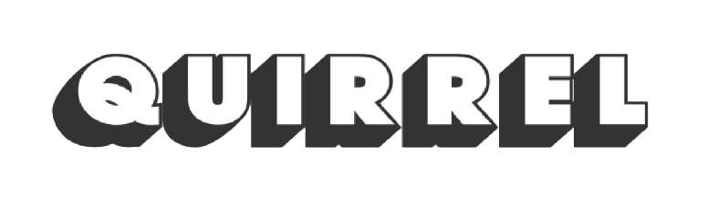





###### Hey！

  <b>Quirrel(奎若)</b>是一款类银河恶魔城游戏 [空洞骑士（Hollow Knight）](https://hkss.huijiwiki.com/wiki/%E7%A9%BA%E6%B4%9E%E9%AA%91%E5%A3%AB_(%E6%B8%B8%E6%88%8F)) 中的一名 NPC。在游戏中出现在各种场景来帮助引导主角。每次看到都给人非常可靠的感觉，我想成为这样的人。

  我目前在郑州的前端岗位实习中。为什么选前端呢，在初中的时候有了手机接触到网络上的各种东西，虽然我学习一直很好，但是一直都没有什么兴趣。就是喜欢研究手机电脑网络之类的，那时候天天给手机刷机，觉得程序员很厉害，写出来的代码能变成各种样子，我那时才知道：啊，网页是这样做出来的！我那时候还很喜欢去网吧，有次在网吧看着 b 站的教学一步一步通宵用 sublime text3 做出了 b 站的导航栏，甚至要求妈妈买了一个 u 盘和 HTML5+CSS3+JS 的书。后来 U 盘在钥匙链上风吹雨打坏了，书也没看完

  从那开始我心里就一直有个前端梦，虽然期间听到很多什么前景不好，内卷严重，但我还是决定 follow my heart。

  总之这个网站是用来纪录工作上的经验，学到的知识等笔记。非常感谢一路帮过我的人，希望我们大家一起进步，努力生活。

> 更多优质文章站点：
>
> CSDN：[CSDN - 专业开发者社区](https://www.csdn.net/)
>
> MDN：[MDN Web Docs (mozilla.org)](https://developer.mozilla.org/zh-CN/)
>
> 码客说：[码客说 - 我是码客，我是全栈工程师，我为自己代言。 (psvmc.cn)](https://www.psvmc.cn/)
